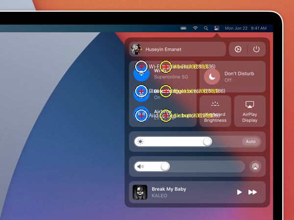
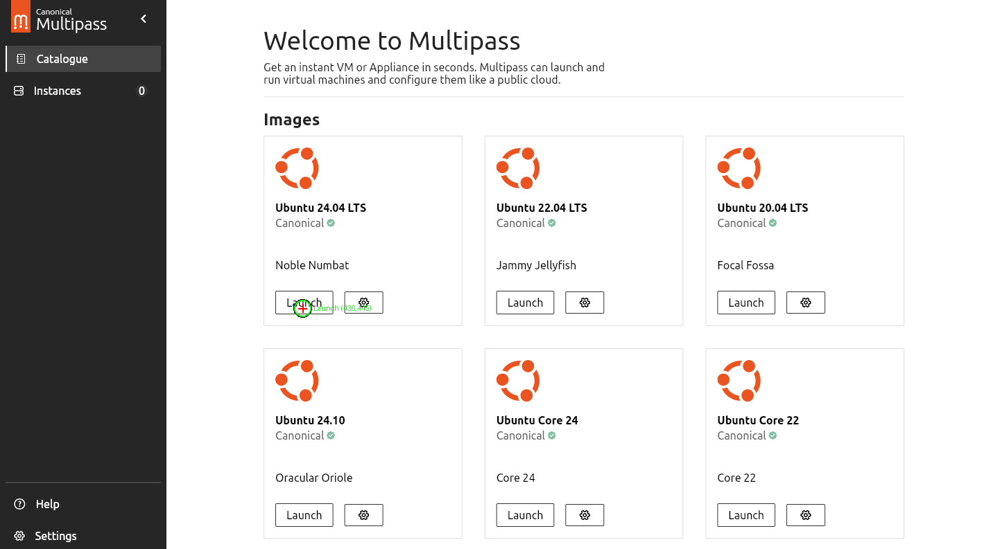
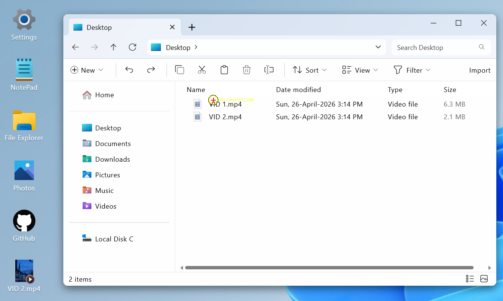
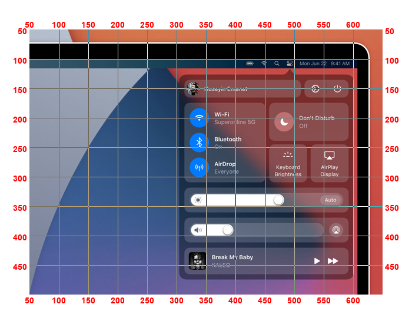
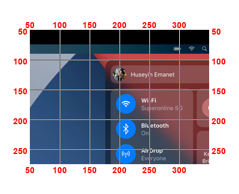

# AI Vision for All

Give any AI agent a reliable pair of eyes — without touching its architecture.

A screenshot becomes a ruler-guided workspace. A vision model reads the rulers like a physical ruler and returns a structured click target for each UI control. Every coordinate is traceable back to the original full-resolution image. Works on any GUI — Mac, Windows, Linux — with no retraining or browser extensions.

MIT-licensed. Built for progress.

---

## Results

Three real screenshots. Three platforms. The crosshair marks the model's best predicted click point, drawn back onto the **original full-resolution screenshot**.

| macOS Control Center | Ubuntu Multipass | Windows 11 File Explorer |
|:---:|:---:|:---:|
|  |  |  |
| *turn off Wi-Fi* | *launch Ubuntu 24.04 LTS* | *open VID 1.mp4* |

Your mileage may vary. These represent typical results with the default model and a small number of passes.

---

## How it works

```text
Screenshot
   ↓  scale to bounded token budget
   ↓  paste onto white canvas with ruler margins
   ↓  draw XOR grid lines + bold red ruler labels
   ↓  ask vision model (reads rulers → pixel click coordinates)
   ↓  validate bounds, map canvas coords → original coords
   ↓  draw verification overlay
   ↓  your automation, after policy approval
```

### The ruler insight

Vision models can describe screens. Getting reliable pixel coordinates is harder. The ruler overlay gives the model spatial anchors — the same way a human uses a physical ruler to read a diagram. Rather than estimating coordinates in an abstract space, the model measures from the ruler ticks it can see.

This project treats the model as an **observer**, not an oracle. Returned coordinates are meant to be inspected, verified, and only then handed to automation code.

### Iterative refinement

The important trick is not asking the model to be perfect in one glance. Full-screen vision finds where to look; cropped vision earns the click.

One pass places the model in the right area. `--passes N` automatically zooms in on the best hit each round, halving the source area on each axis by default:

| Pass | Area covered | What the model sees |
|:---:|:---|:---|
| 1 | Full screenshot | Wide context, initial location |
| 2 | 50% each axis, centred on pass-1 click | Finer ruler marks, tighter focus |
| N | 50% of previous pass source | Progressively more precise |

| Pass 1 — full context | Pass 2 — zoomed in |
|:---:|:---:|
|  |  |

---

## Install

```bash
python -m venv .venv

# macOS / Linux
source .venv/bin/activate
# Windows
.venv\Scripts\activate

pip install -e .
cp .env.example .env
# edit .env — add your GEMINI_API_KEY
```

---

## Usage

### 1. Preview — see what the model sees (no API call)

```bash
aivision preview screenshot.png --output outputs/ruler.png
```

### 2. Analyze — get click coordinates

```bash
aivision analyze screenshot.png \
  --goal "turn off Wi-Fi" \
  --target "the Wi-Fi toggle" \
  --passes 2 \
  --preview outputs/ruler.png \
  --output outputs/result.json
```

With `--passes 2`, per-pass files are written alongside the final result:

```
outputs/result.pass1.json   — first pass (full screenshot)
outputs/result.pass2.json   — second pass (zoomed in)
outputs/result.json         — copy of the final pass

outputs/ruler.pass1.png     — what the model saw in pass 1
outputs/ruler.pass2.png     — what the model saw in pass 2
outputs/ruler.png           — copy of the final pass ruler
```

### 3. Overlay — verify before trusting

```bash
aivision overlay screenshot.png outputs/result.json \
  --output outputs/verify.png
```

---

## Output format

```json
{
  "meta": {
    "source_size": [393, 416],
    "scaled_size": [395, 418],
    "scale": 1.005,
    "model": "gemini-2.5-flash",
    "pass": 2,
    "passes_total": 2,
    "crop_factor": 0.5
  },
  "description": "macOS Control Center showing Wi-Fi connected to Superonline 5G ...",
  "controls": [
    {
      "type": "button",
      "label": "Wi-Fi",
      "x": 358,
      "y": 165,
      "reason": "Centre of the circular Wi-Fi icon. Ruler horizontal ~350 + 8, vertical ~150 + 15.",
      "confidence": 0.97,
      "scaled": { "x": 308, "y": 115 },
      "original": { "x": 182, "y": 68 }
    }
  ]
}
```

**`original.x` / `original.y`** is the click point in the full-resolution original screenshot — pass this to your automation layer.

`scaled` and canvas `x`/`y` are preserved for inspection and debugging.

---

## Flags

```
aivision analyze <image>
  --goal STR          What the agent is trying to accomplish (required)
  --target STR        The specific control to find (recommended — improves focus)
  --passes N          Iterative zoom passes, default 1
  --crop-factor F     Crop diameter per axis as fraction of previous source, default 0.5
  --preview PATH      Save the ruler image the model actually saw
  --output PATH       Save JSON result (default: stdout)
  --model STR         Gemini model, default gemini-2.5-flash-lite
  --rectangle X,Y,W,H Manual initial crop in original-image coordinates
  --grid N            Grid spacing in pixels, default 50
  --margin N          Canvas margin in pixels, default 50
```

---

## Model comparison

Observed on the three included screenshots. Not a rigorous benchmark — your results will vary by UI complexity and goal specificity.

| Model | Passes for reliable result | Input price | Output price |
|:---|:---:|:---:|:---:|
| `gemini-2.5-flash` | 2 | $0.30 / M tokens | $2.50 / M tokens |
| `gemini-2.5-flash-lite` | 5 | $0.10 / M tokens | $0.40 / M tokens |

In these three demo screenshots, Flash Lite with 5 passes reached the same final click quality as Flash with 2 passes, at roughly ¼ the model cost. This is not a benchmark; it is an early signal that structured re-observation can trade extra cheap calls for precision. For high-volume pipelines, the difference matters.

---

## Reproduce the demo

```bash
aivision analyze examples/win11_file_explorer.png \
  --goal "open VID 1.mp4" \
  --target "VID 1.mp4 in File Explorer" \
  --passes 2 \
  --preview outputs/win11_vid_ruler.png \
  --output outputs/win11_vid_result.json

aivision overlay examples/win11_file_explorer.png outputs/win11_vid_result.json \
  --output outputs/win11_vid_overlay.png
```

---

## Safety posture

This tool makes it easier for agents to observe GUIs. Do not wire it directly to mouse and keyboard automation without a confirmation layer.

```text
observe → propose action → verify target → require policy approval → execute → observe again
```

The `overlay` command exists specifically for the verify step. Use it.

Recommended additions before trusting this in production:
- OS-level screenshot capture helpers
- Confidence thresholds and "verify before click" policy enforcement
- OCR fallback for text-heavy UIs
- Local-model path for privacy-sensitive screens
- Action adapters behind explicit approval gates

---

## License

MIT. Built for progress. Use it freely.
